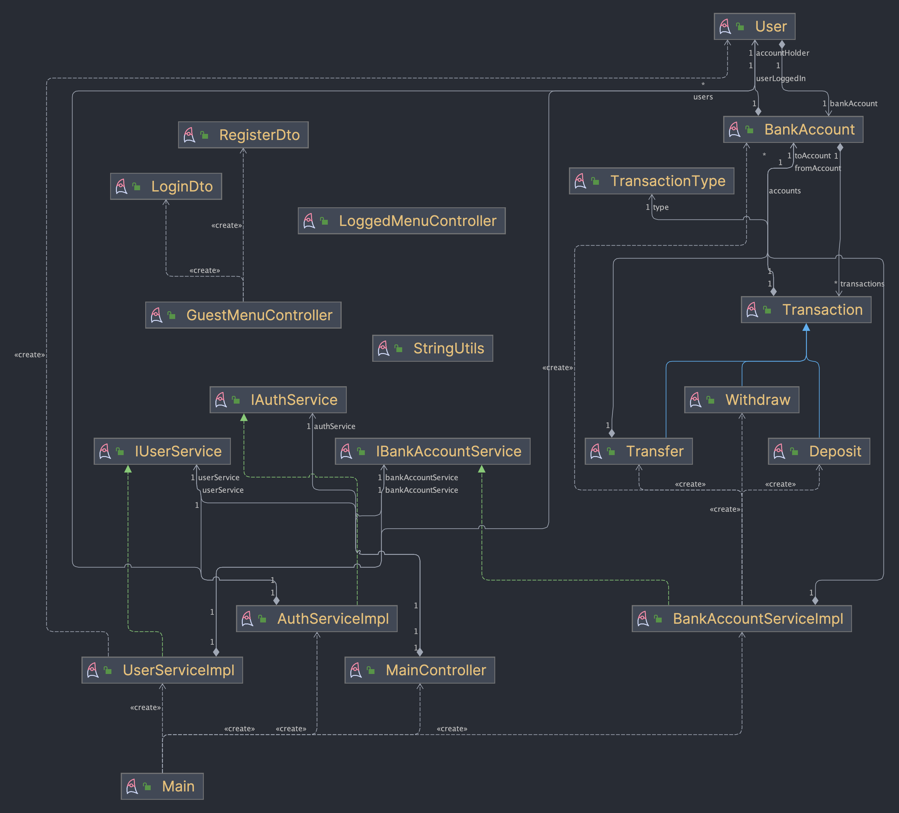

# 👝 Simple VWallet

Simple VWallet es un proyecto escrito con Java para ejercitar conceptos relacionados con la programación orientada a objetos,
tests unitarios, interacción con el usuario y todo esto a través de la consola.

### Info de pruebas
Hay dos usuarios de prueba que se generan al iniciar la aplicación:

- Usuario: `jane@test.com` con contraseña: `123123` rol: usuario vip.
- Usuario: `john@test.com` con contraseña: `123123` rol: usuario normal.

Ambos cuentan con saldo 0.0 y no tienen movimientos.

## 📝 Funcionalidades implementadas

- Crear una cuenta
- Ingresar dinero
- Retirar dinero
- Transferir dinero
- Consultar saldo
- Consultar movimientos
- Salir de la aplicación

> [!NOTE]
> 🧪 Se incluye una pequeña suite de tests unitarios.

## 📚 Requisitos para ejecutar:

- Java 17 o superior.
- Junit 5.11.0 o superior
- Mockito 5.11.0 o superior
- IntelliJ IDEA o cualquier IDE que soporte Java y la configuración de IntelliJ IDEA.

## ▶️ Ejecución

Para ejecutar el proyecto, se debe clonar el repositorio y abrirlo en IntelliJ IDEA o cualquier IDE que soporte Java y
la configuración de IntelliJ IDEA.

## ℹ️ Diagrama de clases
Se adjuntan diagrama de clases global y de dependencias.

- Diagrama de clases global [Diagrama aquí](diagrama_clases.pdf)
- Diagrama de clases con dependencias [Diagrama aquí](diagrama_clases_dependecias.pdf)

### Diagrama de clases:

### Diagrama de clases con dependencias:

