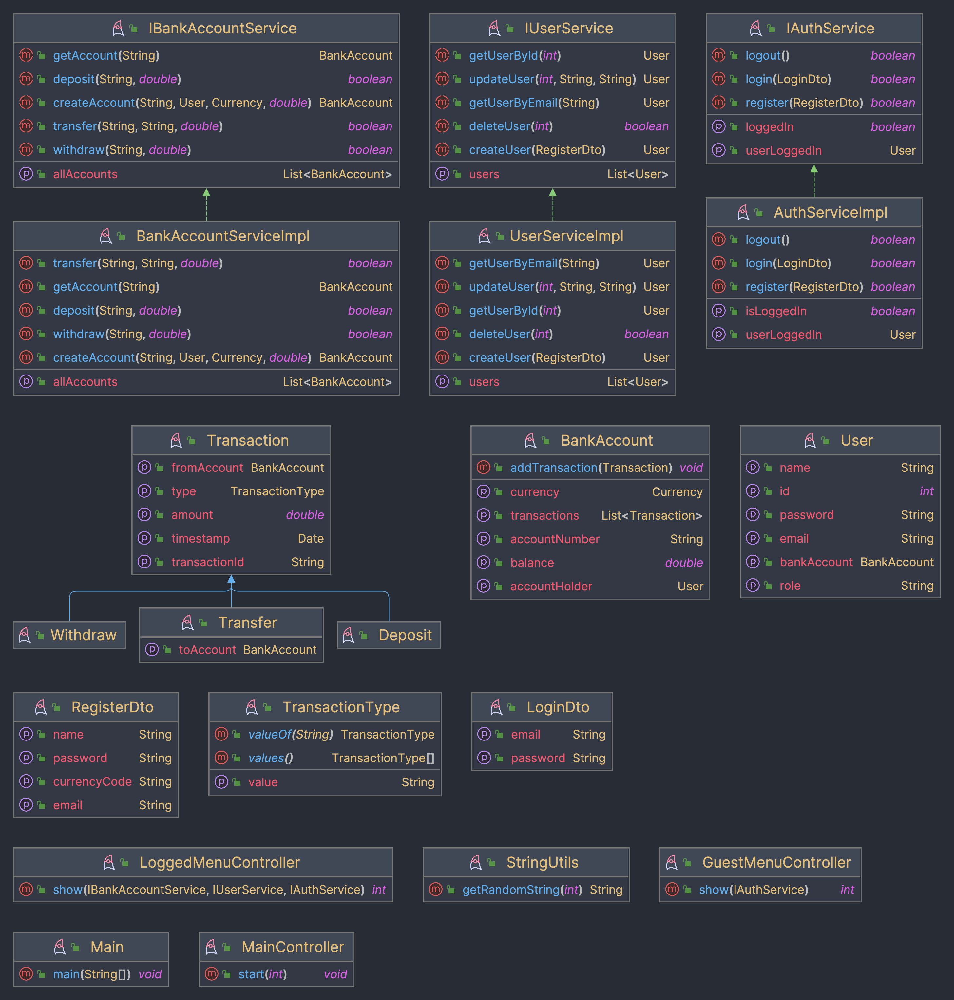

# 👝 Simple VWallet

Simple VWallet es un proyecto escrito con Java para ejercitar conceptos relacionados con la programación orientada a objetos,
tests unitarios, interacción con el usuario y todo esto a través de la consola.

## 📝 Funcionalidades implementadas

- Crear una cuenta
- Ingresar dinero
- Retirar dinero
- Transferir dinero
- Consultar saldo
- Consultar movimientos
- Salir de la aplicación

> [!NOTE]
> 🧪 Se incluye una pequeña suite de tests unitarios.

## 📚 Requisitos para ejecutar:

- Java 17 o superior.
- Junit 5.11.0 o superior
- Mockito 5.11.0 o superior
- IntelliJ IDEA o cualquier IDE que soporte Java y la configuración de IntelliJ IDEA.

## ▶️ Ejecución

Para ejecutar el proyecto, se debe clonar el repositorio y abrirlo en IntelliJ IDEA o cualquier IDE que soporte Java y la configuración de IntelliJ IDEA.

## ℹ️ Diagrama de clases
Se adjunta el diagrama de clases en formato PNG a continuación, pero puede ser consultado en formato PDF en el archivo
[diagrama_clases_pdf.pdf](diagrama_clases.pdf).

